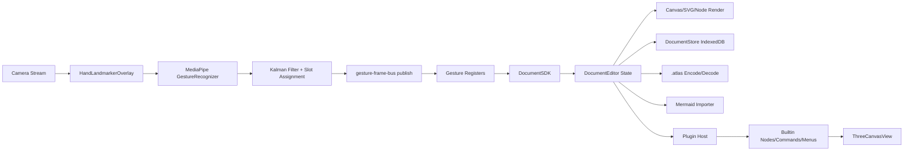

# Atlas 技術解説資料

## 0. この資料の目的

この資料は、Atlas の実コードを根拠に技術的主張を行うためのドキュメントである。  
特に以下を主張軸に据える。

- Cloudflare Workers をデプロイ先とするエッジ配信戦略
- MediaPipe によるローカル推論（カメラ映像の外部送信なし）
- カルマンフィルタによる低遅延平滑化
- プラグインモデルによる拡張性
- 3D Canvas のインタラクティブ操作
- 独自バイナリドキュメントフォーマット（`.atlas`）

## 1. 先に結論（技術主張の要点）

### 1.1 ローカル推論 + エッジ配信の分離

- 推論はブラウザ内（MediaPipe Tasks Vision）で完結
- ホスティングはエッジ環境（Cloudflare Workers）を選択
- これにより、`推論遅延` と `通信遅延` を別々に最適化できる

### 1.2 「リアルタイム性」と「安定性」の両立

- ハンドランドマークに対して 2 状態カルマンフィルタ（位置 + 速度）を適用
- 追従性と安定性のトレードオフを、パラメータと将来予測でチューニング
- 低遅延のまま、ランドマークの暴れを実用レベルで抑制

### 1.3 UI 機能をプラグイン化し、将来の機能追加コストを定数化

- ノード型・メニュー・コマンド・キーバインドを `register()` で注入
- エディタ本体は SDK 契約のみを参照
- 機能追加時に既存コードの改修面積を抑える設計

### 1.4 データモデルと保存形式を自前定義

- ドキュメント構造（ノード/エッジ/カメラ）を型で厳密化
- `.atlas` に JSON + バイナリメディアを一体化
- image / 3D model を埋め込み、単一ファイルで可搬化

## 2. 実装全体像



## 3. アプリケーション層の責務分離

### 3.1 レイアウト層（`src/layout.tsx`）

- アプリシェル（ヘッダ/サイドバー/本体）を構成
- テーマ切替（system/light/dark）
- カメラ ON/OFF、ミラー設定を `localStorage` 永続化
- `HandLandmarkerOverlay` と `DocumentPane` を重ねて表示

ポイント:

- カメラ権限を Permissions API で監視し、拒否時に UI 状態へ反映
- 推論描画層とドキュメント編集層を視覚的に分離しつつ共存

### 3.2 ドキュメントストア層（`src/components/document/store.tsx`）

- 複数ドキュメント管理（作成/改名/削除/アクティブ切替）
- IndexedDB に永続化
  - DB: `atlas.documents`
  - store: `docs`, `meta`
  - activeId を `meta` に保持
- 永続化データは `.atlas` Blob（内部で encode/decode）

ポイント:

- 保存は Promise キューで直列化し、競合書き込みを防止
- 読み込み失敗レコードは握りつぶして継続（壊れたデータ耐性）
- ドキュメントが 0 件にならない安全設計

### 3.3 サイドバー/UI基盤（`src/components/ui/sidebar.tsx` + `src/components/app-sidebar.tsx`）

- デスクトップは固定サイドバー、モバイルは `Sheet` 化
- 折りたたみ状態は `expanded/collapsed` 状態機械で管理
- `Ctrl/Cmd + b` でサイドバー開閉（グローバルショートカット）
- ドキュメント一覧:
  - インライン改名（Enter確定 / Escapeキャンセル / blur確定）
  - 削除確認ダイアログ
  - タイトル一致優先 + ノード文字列プロパティ全文検索

補足:

- `sidebar_state` cookie への書き込み実装はあるが、読み戻し実装は現時点で未使用

### 3.4 テーマ・表示設定（`src/hooks/use-theme.ts`）

- `theme` を `localStorage("theme")` に永続化
- `system` 選択時は `prefers-color-scheme` 変更を購読
- `document.documentElement.classList("dark")` で即時反映

## 4. エディタ中核（`DocumentEditor`）の実装詳細

### 4.1 状態マシン

- `tool`: `select | add | connect`
- `selection`: `none | node | edge`
- `drag`: `none | pan | move | resize | drawShape`
- `camera`: `x, y, scale`

これにより、同一ポインタ操作でもモードに応じて振る舞いを切替可能。

### 4.2 2D ビュー変換

- スクリーン座標 -> ドキュメント座標変換を `camera` で実施
- ズームはカーソル位置アンカー方式（視点の飛びを抑制）
- ホイールズーム係数は `exp(-delta * 0.0012)` を採用
- カメラ更新は即時反映 + 遅延コミット（150ms）で保存頻度を制御

### 4.3 ノード/エッジ描画

- ノード: DOM レイヤ（絶対配置）で描画
- エッジ: SVG パスで描画（直線/曲線、矢印、破線、ラベル）
- 接続先プレビュー: connect ツール時に仮想パスをリアルタイム描画

### 4.4 編集操作

- 選択モード: クリック選択 + ドラッグ移動
- リサイズ: 右下ハンドル
- パン: Space+ドラッグ or 中クリック
- 追加モード:
  - `placement.kind=click` はクリック即配置
  - `placement.kind=drag` はドラッグでサイズ決定
- 接続モード: 始点ノード -> 終点ノードでエッジ生成

### 4.5 IO 統合

- `ATLAS書き出し`: `createAtlasBlob()` でダウンロード
- `ATLAS読み込み`: `decodeAtlasDocument()` で復元
- `Mermaid読み込み`: 解析結果を既存ドキュメントへマージ

### 4.6 キーバインド解決アルゴリズム

- `mod/cmd/ctrl/shift/alt/option` を厳密に解釈
- 「必要でない modifier が押されていたら不一致」にする設計
- テキスト入力中は `allowInTextInput` がないキーバインドを無効化
- Mac 判定時は `mod` を `meta`、それ以外は `ctrl` にマップ

この設計により、ショートカット誤爆を抑えている。

### 4.7 エッジ接続の幾何アルゴリズム

- ノード中心同士ではなく「ノード境界交点」で接続
- 形状別の境界計算:
  - rect: 軸整列矩形の交点
  - ellipse/circle: 楕円交点
  - diamond: L1 ノルム境界
- 曲線は 3 次ベジェ制御点を距離依存で算出
  - `curveStrength` を `0.05..0.6` にクランプ

効果:

- 見た目の接続品質が高く、形状変更後も破綻しにくい

### 4.8 細部UX実装

- 色入力:
  - `#rgb/#rrggbb` に加え `rgb()/rgba()` を受け取り hex 正規化
- 図形ドラッグ生成:
  - `Shift` 押下で正方形ロック
  - クリックだけなら `defaultSize` で配置
- グリッド:
  - `camera.scale` に追従して `backgroundSize/backgroundPosition` を再計算
- ファイル名:
  - `\/:*?"<>|` を `_` へ置換して安全化

## 5. プラグインアーキテクチャ

### 5.1 契約（`src/plugin.ts`）

- `BasePlugin.register(ctx)` が `PluginContribution` を返す
- 拡張点:
  - nodes
  - menus（add/file/edit/view）
  - commands
  - keybindings

### 5.2 実行基盤（`src/components/document/plugin-system.ts`）

- 複数プラグインを集約して `PluginHost` を構築
- 重複ノード型・重複コマンド ID を検出して例外化

### 5.3 SDK（`src/components/document/sdk.ts`）

プラグインに公開される操作面:

- `doc.get/set/update`
- `selection.get/set/clear`
- `tool.get/set`
- `camera.get/set`
- `viewport.zoomTo/zoomBy`
- UI アクション（export/import/mermaid dialog）

効果:

- プラグインは React コンポーネント直叩き不要
- 編集コアとの結合度を下げ、差し替え可能性を維持

### 5.4 ビルトイン実装（`src/plugins/builtin/*`）

- ノード:
  - text
  - image（埋め込みメディア）
  - shape（多形状）
  - three-canvas（3D）
- メニュー:
  - 追加/ファイル/編集/表示
- コマンド:
  - 追加、削除、ズーム、グリッド切替、入出力
- キーバインド:
  - `mod+s`, `delete`, `backspace`, `escape`

### 5.5 コマンド実行モデルの特徴

- メニュー項目は `command` 優先で実行（`onSelect` は後方互換）
- `pluginHost.commands.execute(id)` は存在しない ID を無視
- `run()` は `void | Promise<void>` を許容（非同期実行対応）
- ノード追加系コマンドは `tool` 状態遷移のみ実施し、配置はエディタ責務

### 5.6 プラグインノード定義の表現力

`NodeTypeDef` は以下を持つため、型定義だけで挙動を完結可能。

- `placement.kind`: `click | drag`
- `create(ctx)`: 同期/非同期対応
- `render(ctx)`: JSX + style + aria + class 返却
- `inspector(ctx)`: プロパティ編集 UI 注入
- `onDoubleClick(ctx)`: ノード固有の直接操作

## 6. MediaPipe ローカル推論パイプライン

### 6.1 推論コンポーネント（`src/components/vision/hand-landmarker-overlay.tsx`）

- `@mediapipe/tasks-vision` の `GestureRecognizer` を使用
- モデル: `/tasks/gesture_recognizer.task`
- WASM: jsdelivr の tasks-vision パス
- 推論設定:
  - `runningMode: "VIDEO"`
  - `numHands: 2`
  - `minHandDetectionConfidence: 0.2`
  - `minHandPresenceConfidence: 0.2`
  - `minTrackingConfidence: 0.2`
- Delegate:
  - 第1候補 GPU
  - 失敗時 CPU へフォールバック

### 6.2 モデルキャッシュ

- IndexedDB:
  - DB: `atlas.media`
  - store: `models`
  - key: `gesture_recognizer.task`
- 初回 fetch 後に Blob 保存
- 次回起動はキャッシュから URL 生成して使用

### 6.3 ランドマーク平滑化（カルマンフィルタ）

#### 6.3.1 フィルタモデル

- 1 次元 2 状態（位置 `x`、速度 `v`）
- 各ランドマークの x/y に個別適用
- `dt` をフレーム間時間から計算し離散更新
- 将来予測 `predictAhead` を加えて表示遅延を抑制

#### 6.3.2 実パラメータ

- フィルタ生成時:
  - `processNoise = 8e-2`
  - `measurementNoise = 2e-3`
- 予測先読み:
  - `lead = min(0.08, dt * 1.5)`

この設定により、過剰に鈍くせずノイズのみを削る挙動を狙っている。

### 6.4 手のスロット割当（左右入れ替わり対策）

- スロット数 2（各スロットにラベル/最終中心/フィルタ群を保持）
- コスト関数でランドマーク群をスロットに安定割当
- パラメータ:
  - `maxJump = 0.25`
  - `slotStaleMs = 450`
  - `slotExpireMs = 700`
- 2 手時は 2x2 最適割当でスワップ抑制

### 6.5 GestureFrame への正規化と配信

- 推論結果を viewport 基準で正規化（0..1）
- `publishGestureFrame()` で bus へ配信
- エディタ側は `subscribeGestureFrame()` で購読

### 6.6 実運用パラメータ一覧（推論・平滑化）

| 項目                         |                  値 | 意図                             |
| ---------------------------- | ------------------: | -------------------------------- |
| `numHands`                   |                   2 | 両手ジェスチャー対応             |
| `minHandDetectionConfidence` |                 0.2 | 初期検出感度を高める             |
| `minHandPresenceConfidence`  |                 0.2 | 手存在判定を取りこぼしにくくする |
| `minTrackingConfidence`      |                 0.2 | トラッキング継続性優先           |
| `processNoise`               |                8e-2 | 追従性確保（過度な鈍化防止）     |
| `measurementNoise`           |                2e-3 | 観測ノイズ除去を強める           |
| `lead`                       | `min(0.08, dt*1.5)` | 見かけ遅延を抑える先読み         |
| `maxJump`                    |                0.25 | 瞬間ワープ抑止                   |
| `slotStaleMs`                |               450ms | 一時的ロスト時のスロット保持     |
| `slotExpireMs`               |               700ms | 長期ロスト時のスロット破棄       |

### 6.7 オーバーレイ同期と描画パイプライン

- オーバーレイはドキュメントビューポート要素（`data-atlas-doc-viewport="true"`）を追従
- `ResizeObserver` + `window resize/scroll` で位置・サイズ同期
- カメラ描画は `video` 要素を直接表示せず `canvas` 合成
  - ぼかし: `ctx.filter = "blur(12px)"`
  - 暗幕: `rgba(0,0,0,0.5)` を全面描画
  - その上にランドマークを重畳
- `mirrored` は描画コンテナに `scaleX(-1)` を適用

### 6.8 フレームライフサイクル設計

- 無効化/アンマウント時:
  - `requestAnimationFrame` 停止
  - `MediaStreamTrack.stop()`
  - canvas クリア
  - 空の `GestureFrame` を publish
- 権限拒否時:
  - `onPermissionChange("denied")`
  - `onRequestDisable()` で UI 側に停止を要求

効果:

- UI とジェスチャー処理が「カメラ停止状態」に確実に収束する

## 7. ジェスチャー制御層（Gesture Registers）

### 7.1 設計

- `GestureRegister` 抽象クラスを拡張して実装
- 各 register は `onFrame(frame, ctx)` を実装
- 必要に応じて `onReset()` を実装

### 7.2 実装一覧

- `DoubleClosedFistZoomGestureRegister`
  - 両手グーで距離変化からズーム比率算出
  - スケールを `0.2..3` にクランプ
  - `MIN_HAND_DISTANCE_PX = 16`
  - `MIN_CLOSED_FIST_SCORE = 0.5`
  - midpoint アンカーでズーム中心維持
- `PinchDragNodeGestureRegister`
  - 親指先(4)と人差し指先(8)の距離でピンチ検出
  - `PINCH_THRESHOLD_PX = 25`
  - `MOVE_EPSILON = 1e-3`
  - `ORBIT_MOVE_EPSILON_PX = 0.5`
  - ノード移動 or 3D orbit を切替
  - three-canvas はヘッダ領域（32px）だけ移動、本文は orbit
- `ClosedFistPanGestureRegister`
  - 片手グーの手首移動でカメラパン
  - `MIN_CLOSED_FIST_SCORE = 0.5`

### 7.3 3D 連携

- `three-canvas-control-bus` で nodeId 単位に controller 登録
- ジェスチャー層から `orbitThreeCanvasByScreenDelta()` を呼び出し
- エディタ本体と 3D 実装の依存を疎結合化

## 8. 3D Canvas ノード実装

### 8.1 ノード仕様

- type: `three-canvas`
- props:
  - `model: EmbeddedBinaryMedia | null`
  - `fileName: string`
  - `background: string`

### 8.2 レンダラ実装（`three-canvas-view.tsx`）

- `THREE.WebGLRenderer({ antialias: true, alpha: true })`
- `OrbitControls` 有効化（damping）
- `GLTFLoader` で glTF/glb ロード
- モデル中心を原点へ平行移動してフレーミング
- `ResizeObserver` でリサイズ追従
- unmount 時に geometry/material を明示破棄

### 8.3 UI/操作

- ノードヘッダにファイル名表示
- Inspector から gltf/glb を埋め込み更新
- ダブルクリックでモデル差し替え
- ジェスチャーで orbit 操作可能

### 8.4 ノード実装全体での特筆点（`src/plugins/builtin/nodes.tsx`）

- image ノード:
  - 初期画像は `https://placehold.co/320x220.png` 取得を試行
  - 失敗時は埋め込み 1x1 PNG バイト列へフォールバック
  - `WeakMap<Uint8Array, string>` で data URL キャッシュ
- three-canvas ノード:
  - MIME が空でも拡張子 (`.gltf/.glb`) から推定
  - 埋め込みメディア化して `.atlas` に同梱
- shape ノード:
  - `rect/stadium/subroutine/cylinder/circle/doublecircle/diamond/hexagon/parallelogram/trapezoid/invtrapezoid`
  - clipPath + 補助図形で Mermaid 近似形状を再現
  - custom shape に対して選択リングを形状追従で描画

## 9. 独自バイナリフォーマット `.atlas`

### 9.1 目的

- ドキュメント + 埋め込みバイナリを単一ファイルで輸送
- 外部参照なしで復元可能にする

### 9.2 ヘッダ構造（Little Endian）

- `MAGIC` (`"ATLAS"`)
- `formatVersion` (1 byte)
- `jsonLength` (uint32)
- `mediaCount` (uint32)
- `jsonBytes`
- media entries:
  - `mimeLength` (uint16)
  - `mimeBytes`
  - `dataLength` (uint32)
  - `dataBytes`

### 9.3 メディアシリアライズ方針

- ノード種別ごとにメディアフィールドを schema 管理
  - `image.media`（必須）
  - `three-canvas.model`（任意）
- JSON 本体には `mediaIndex` 参照を保存
- デコード時に `EmbeddedBinaryMedia` へ復元

### 9.4 バリデーション

- magic/version/境界チェック
- DocumentModel の形状チェック（version, camera, canvas, nodes/edges）
- 不正ファイルは例外化して読み込み失敗として扱う

### 9.5 互換性・堅牢性の工夫

- `bytes` は `Uint8Array / ArrayBuffer / number[]` を受理して正規化
- 必須メディア欠損（例: `image.media`）は encode/decode 時に検出
- optional メディア（`three-canvas.model`）は `null` 許容
- 末尾余剰データを拒否して破損ファイル混入を防止

## 10. Mermaid インポータ

### 10.1 対応記法

- `flowchart` / `graph`
- `mindmap`

### 10.2 処理段階

1. パース（ノード形状・エッジ方向・ラベル抽出）
2. レイアウト（方向別 rank 配置 / mindmap 木配置）
3. Atlas ノード/エッジへ変換
4. 既存ドキュメントに衝突回避 ID でマージ

### 10.3 実装上の工夫

- Mermaid 形状を shape ノードへマッピング
- 双方向矢印・破線・太線（`=`）を DocEdge へ反映
- mindmap は左右ブランチ分割で視認性を確保

### 10.4 パーサ仕様の詳細（実装準拠）

- 矢印トークン:
  - `<-->`, `<==>`, `-.->`, `<--`, `<==`, `-->`, `==>`, `---`
- flowchart 方向:
  - `TB/TD/LR/RL/BT`（未指定は `TB`）
- ノード形状パターン:
  - `[( )]` stadium, `[[ ]]` subroutine, `[()]` cylinder, `(( ))` circle, `((( )))` doublecircle
  - `{ }` diamond, `{{ }}` hexagon, `[/ /]` parallelogram 等
- mindmap:
  - 2スペース単位インデントを階層として解釈
  - `::icon` / `:::` は読み飛ばし

## 11. データモデル（DocumentModel）

```ts
type DocumentModel = {
  version: 1;
  title: string;
  camera: { x: number; y: number; scale: number };
  canvas: { width: number; height: number; background: "grid" | "plain" };
  nodes: Record<string, DocNode>;
  nodeOrder: string[];
  edges: Record<string, DocEdge>;
  edgeOrder: string[];
};
```

このモデルを中心に、UI、保存、入出力、プラグイン、ジェスチャーが統一されている。

### 11.1 モデル拡張時の注意点

- `DocNode` は `Record<string, unknown>` を許容する拡張前提型
- そのため、実運用ではノード type ごとに `props` の実効スキーマ管理が必須
- `model.ts` の `STORAGE_KEY` は現実装では未使用（IndexedDB 実装へ移行済み）

## 12. パフォーマンスと遅延設計

### 12.1 低遅延化の主要要因

- 推論をローカル実行（ネットワーク往復なし）
- GPU delegate 優先
- 平滑化を軽量 1D フィルタで実装
- カメラ永続化コミットを遅延実行
- 3D 描画は node 単位で分離し必要時のみ実行

### 12.2 安定化の主要要因

- 手スロット追跡（左右入れ替わり抑制）
- ジャンプ抑止閾値・失効時間の設計
- gesture ごとの明確な mode 切替（競合低減）

### 12.3 ビルド実測（2026-03-06 時点）

- `dist/assets/index-*.js`: 約 1,185 KB（gzip 約 335 KB）
- Vite の chunk size 警告（500KB超）が発生
- 主因候補:
  - MediaPipe runtime
  - Three.js + GLTFLoader/OrbitControls
  - UI コンポーネント群の同梱

示唆:

- 3D/推論/UI を遅延ロード分割すると初期表示はさらに改善余地あり

## 13. セキュリティ/プライバシー観点

- カメラ映像はブラウザ内で処理
- 推論結果はローカル状態として扱う
- ドキュメント保存は IndexedDB ローカル保存
- `.atlas` 書き出しはユーザー明示操作時のみ

## 14. Cloudflare Workers デプロイ戦略

### 14.1 現行サーバ実装の内容（`src/server/index.ts`）

- `Hono` + `serveStatic` で `dist` を配信
- `GET /api/health` を提供
- SPA fallback で `index.html` を返却

### 14.2 Workers を選ぶ理由

- エッジ配信で初期ロードを高速化
- Hono を採用しているためランタイム移植しやすい
- 推論はクライアント側なので Workers 側に GPU 要件が不要

### 14.3 移行方針

- Hono の Workers アダプタへ差し替え
- CI/CD で `vite build` 成果物を Workers にデプロイ

## 16. まとめ

Atlas は、以下を一貫した設計として成立させている。

- **Local AI**: MediaPipe のブラウザ内推論
- **Low-latency UX**: カルマン平滑化 + 予測 + ジェスチャー分離
- **Extensibility**: SDK/PluginHost による拡張機構
- **Rich Interaction**: 2D ノード編集 + 3D Canvas 操作
- **Portable Data**: 独自 `.atlas` バイナリで完全持ち運び
- **Edge-ready**: Workers を前提にした配信設計へ移行しやすい構造

## 17. 追加で特筆すべき実装（逐次列挙）

1. **権限連動UI**: カメラ権限が `granted` の初回のみ自動有効化するガード実装がある（`permissionInitRef`）。
2. **カメラ停止時の安全収束**: 無効化時に空フレーム publish まで行い、gesture state を残さない。
3. **gesture register のリセット契約**: ドキュメント切替時にも `onReset()` を呼び、前ドキュメントの運動状態を持ち越さない。
4. **スロット割当のラベルペナルティ**: `Left/Right` 推定が安定している場合はスロット交換コストを上げる。
5. **2x2 最適割当**: 両手検出時、全探索に近い簡易最適化でスワップを抑止。
6. **MediaPipe delegate フォールバック**: GPU 失敗時に CPU を自動再試行するため、環境依存で機能停止しにくい。
7. **ノード追加の非同期対応**: `NodeTypeDef.create()` が Promise を返しても追加フローが破綻しない。
8. **図形境界接続**: 接続線の始終点が形状境界に張り付くため、視覚的一貫性が高い。
9. **ベジェ中点ラベル配置**: 曲線エッジでもラベル位置が中点計算で自然に配置される。
10. **カメラコミット遅延**: UIレスポンスは即時、保存は遅延で I/O 圧縮する二段構え。
11. **ドキュメントロード時の耐障害性**: decode 失敗エントリをスキップして起動継続する。
12. **削除安全策**: 最後のドキュメント削除時は自動で新規ドキュメントを再生成する。
13. **サイドバー検索の本文対象化**: タイトルだけでなく node props の文字列全文を検索対象にしている。
14. **Shape 描画戦略**: clipPath だけでなく、図形ごとに境界線と塗りを分離して再現精度を上げている。
15. **subroutine/cylinder の専用描画**: 単なる角丸矩形ではなく、記号固有の罫線表現を実装。
16. **image data URL キャッシュ**: 同じ `Uint8Array` からの再変換を避け、描画時コストを抑える。
17. **3D リソース解放**: unmount で geometry/material を辿って dispose し、リークを抑制。
18. **3D ジェスチャー境界設計**: ヘッダは移動、本文は orbit とモード分離し誤操作を抑える。
19. **Mermaid 双方向矢印対応**: `<-->`, `<==>` を `arrow: both` に正規化。
20. **Mermaid ノード衝突回避**: 既存 ID 集合を受け取り、追加時に一意 ID を保証。
21. **`.atlas` の schema 駆動メディア埋め込み**: ノード type ごとに required/optional を切り替え可能。
22. **`.atlas` 境界検証**: 各セクション読取前にバイト境界を検証し、破損ファイルに強い。
23. **ホットキー厳密一致**: 不要な modifier が押されている場合に不一致とする設計。
24. **ファイル名サニタイズ**: 禁止文字を置換して OS 非依存の書き出し互換性を確保。
25. **開発サーバの強制終了ハンドリング**: 開いている socket を destroy して終了遅延を避ける。
26. **TS strict 構成**: `strict`, `noUnused*`, `noUncheckedSideEffectImports` で静的品質を担保。
27. **alias 一元化**: Vite/TS で `@/*` を統一し、import パスの保守性を向上。
28. **ダークテーマ同期**: `prefers-color-scheme` 変化を監視して system モードで追従。
29. **UI レイヤ分離**: overlay は `pointer-events-none` で編集操作と衝突しない。
30. **開発デモ資産**: `sample_data/Untitled.glb` を同梱し、3D デモを再現しやすくしている。

---

## 付録 A: 主要ファイルマップ

- アプリシェル: `src/layout.tsx`
- ドキュメント保存: `src/components/document/store.tsx`
- エディタ本体: `src/components/document/editor.tsx`
- SDK/プラグイン基盤:
  - `src/components/document/sdk.ts`
  - `src/components/document/plugin-system.ts`
  - `src/plugin.ts`
- ビルトインプラグイン:
  - `src/plugins/builtin/index.tsx`
  - `src/plugins/builtin/nodes.tsx`
  - `src/plugins/builtin/commands.ts`
  - `src/plugins/builtin/menus.ts`
  - `src/plugins/builtin/mermaid.ts`
- ジェスチャー:
  - `src/components/vision/hand-landmarker-overlay.tsx`
  - `src/components/vision/gesture-frame-bus.ts`
  - `src/plugins/builtin/gestures/*.ts`
- 3D:
  - `src/plugins/builtin/three-canvas-view.tsx`
  - `src/plugins/builtin/three-canvas-control-bus.ts`
- バイナリフォーマット:
  - `src/components/document/atlas-binary.ts`
- 現在の dev サーバ:
  - `src/server/index.ts`
